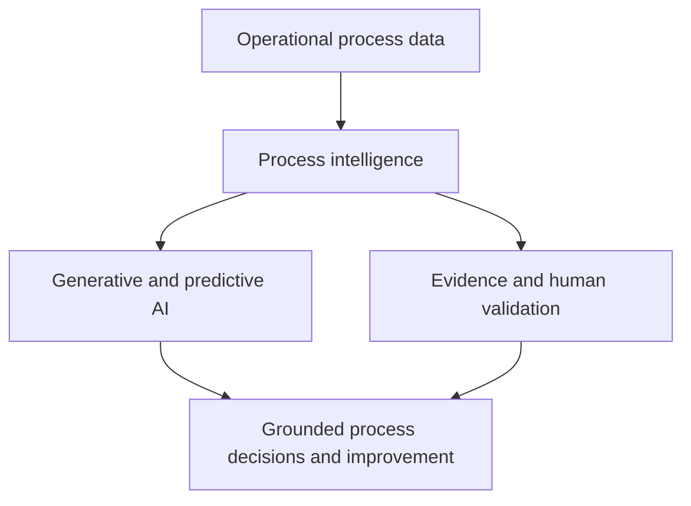

# COIT20252 Business Process Management

## Assessment 1 — E-Portfolio 1: Process Analysis

**Student name:** Mst Sinha Naznin  
**Student ID:** 12285155  
**Repository URL:**   
**Reflection word count:** 500 words 

## Artefact 1 — Why AI needs process intelligence

**Week:** 1 — Evolution of AI and emerging technologies in BPM  
**Type:** 2025 YouTube conference keynote  
**Artefact:** [Towards True Process Intelligence | Wil van der Aalst | IntelliSys 2025](https://www.youtube.com/watch?v=s67S74mnOUc)

*Figure 1. Author-created interpretation of van der Aalst's IntelliSys 2025 keynote (2025).*

In this 2025 IntelliSys keynote, Wil van der Aalst explains that organisations need process intelligence to use artificial intelligence effectively. AI outputs become more useful when grounded in end-to-end operational data, process relationships and organisational context, rather than isolated documents or activities. The keynote therefore positions process mining as an important foundation for generative, predictive and prescriptive applications (van der Aalst 2025).

I selected this video because it extends Week 1's discussion of emerging technologies in BPM. Previously, I saw AI mainly as automation for tasks. I now understand that improvement requires visibility across the process and evidence about how work occurs. This insight will help me question whether future AI proposals are grounded in process data, validated by people and connected to organisational outcomes.

---
