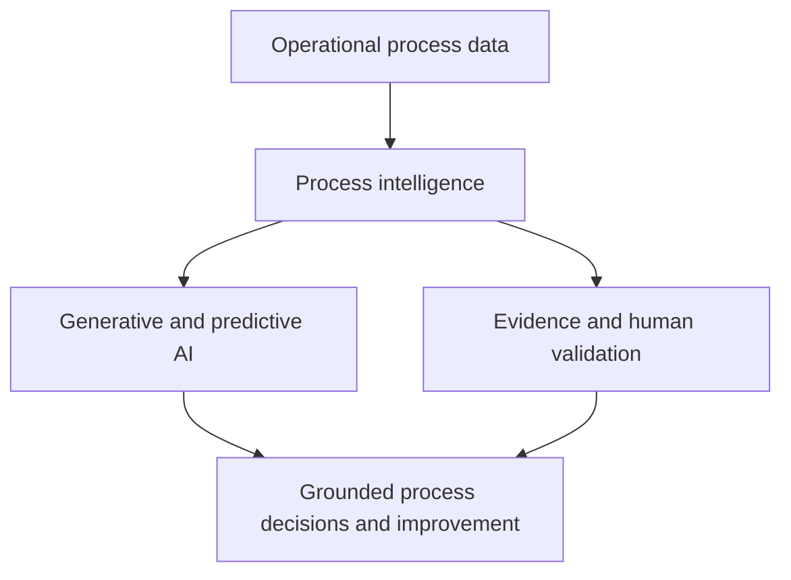

# COIT20252 Business Process Management

## Assessment 1 — E-Portfolio 1: Process Analysis

**Student name:** Mst Sinha Naznin  
**Student ID:** 12285155  
**Repository URL:**   
**Reflection word count:** 500 words 

## Artefact 1 — Why AI needs process intelligence

**Week:** 1 — Evolution of AI and emerging technologies in BPM  
**Type:** 2025 YouTube conference keynote  
**Artefact:** [Towards True Process Intelligence | Wil van der Aalst | IntelliSys 2025](https://www.youtube.com/watch?v=s67S74mnOUc)

*Figure 1. Author-created interpretation of van der Aalst's IntelliSys 2025 keynote (2025).*

In this 2025 IntelliSys keynote, Wil van der Aalst explains that organisations need process intelligence to use artificial intelligence effectively. AI outputs become more useful when grounded in end-to-end operational data, process relationships and organisational context, rather than isolated documents or activities. The keynote therefore positions process mining as an important foundation for generative, predictive and prescriptive applications (van der Aalst 2025).

I selected this video because it extends Week 1's discussion of emerging technologies in BPM. Previously, I saw AI mainly as automation for tasks. I now understand that improvement requires visibility across the process and evidence about how work occurs. This insight will help me question whether future AI proposals are grounded in process data, validated by people and connected to organisational outcomes.

---

## Artefact 2 — Organising and implementing BPM

**Week:** 2 — BPM principles, ownership and life-cycle implementation  
**Type:** 2025 academic textbook  
**Artefact:** [Business Process Management: Analysis, Modeling, Optimization, and Controlling of Processes](https://doi.org/10.1007/978-3-658-49339-4)

| Textbook section | Pages | Week 2 connection |
|---|---:|---|
| Organisation and implementation | 63–83 | Governance, responsibility and implementation |
| Process controlling | 84–102 | Performance measurement and control |
| Modelling and analysis | 103–174 | Evidence-based examination and redesign |

*Table 1. Author-created Week 2 reading map based on Gadatsch (2025, pp. 63–174).*

Gadatsch's 2025 textbook presents BPM as an integrated approach rather than only process modelling. Its organisation and implementation chapter is followed by process controlling, modelling and analysis, showing that governance, measurement and redesign work together. This structure supports Week 2's focus on BPM principles, process ownership and life-cycle implementation across boundaries (Gadatsch 2025, pp. 63-174).

I selected this textbook because it gives a foundation for applying Week 2 concepts. As a Coles Scan Assist team member, I can see that checkout performance depends on clear responsibilities, technology, handoffs and measures. The reading helped me understand that assigning a process owner is insufficient without authority, data and continuous control. In future analysis, I would connect frontline observations with governance and performance indicators before recommending process change.

---
