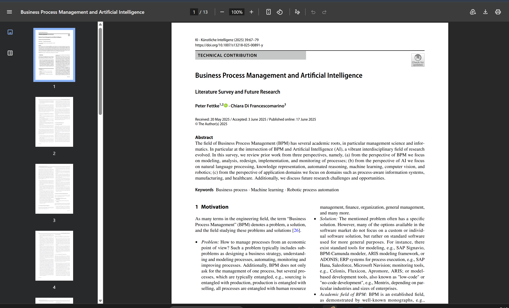

# COIT20252 Business Process Management

## e-Portfolio 1: Process Analysis

**Student name:** Mst Sinha Naznin  
**Student ID:** 12285155  
**Term:** 2  2026

---

## Artefact 1: AI-Assisted Business Process Analysis

**Week:** 1  
**Artefact type:** Peer-reviewed journal article  
**Link:** <https://doi.org/10.1007/s13218-025-00891-y>

**Summary: Fettke and Di Francescomarino research how artificial intelligence (AI) fits into the BPM lifecycle. They note that natural-language processing plus machine learning and knowledge representation and automated reasoning can help in process modelling, analysis, redesign and control. In relation to analysis, the authors highlight that such approaches as natural-language processing, machine learning, knowledge representation, and automated reasoning can improve the quality of process logs, enabling the identification of patterns, weaknesses, and insights (Fettke & Di Francescomarino 2025, pp. 69-75).
