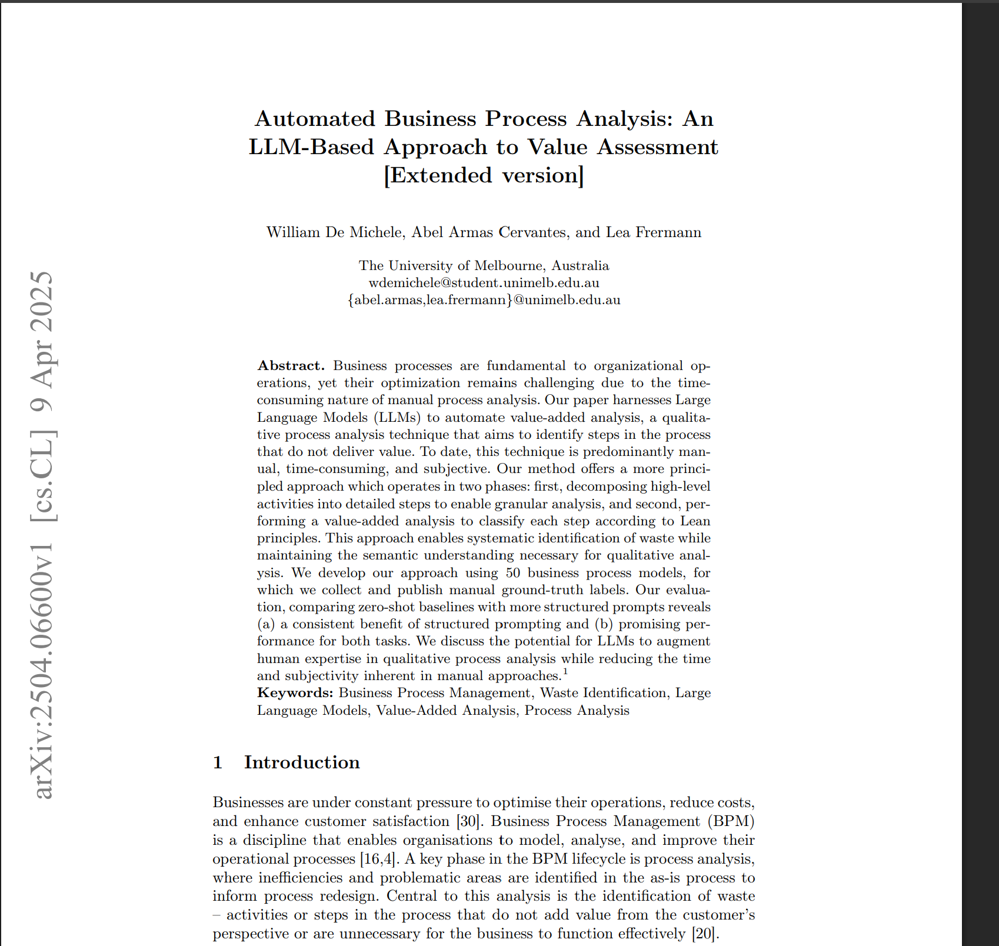

# COIT20252 Business Process Management

## e-Portfolio 1: Process Analysis

**Student name:** Mst Sinha Naznin  
**Student ID:** 12285155  
**Term:** 2  2026

---

## Artefact 1: AI-Assisted Business Process Analysis

**Week:** 1  
**Artefact type:** Peer-reviewed journal article  
**Link:** <https://doi.org/10.1007/s13218-025-00891-y>

**Summary:** Fettke and Di Francescomarino research how artificial intelligence (AI) fits into the BPM lifecycle. They note that natural-language processing plus machine learning and knowledge representation and automated reasoning can help in process modelling, analysis, redesign and control. In relation to analysis, the authors highlight that such approaches as natural-language processing, machine learning, knowledge representation, and automated reasoning can improve the quality of process logs, enabling the identification of patterns, weaknesses, and insights (Fettke & Di Francescomarino 2025, pp. 69-75).

**Justification:** I chose this particular artefact as it built upon the discussion on emerging technologies from week 1, in particular, how they can be integrated into the processes. I think this particular artefact helped me understand that while AI can support analysts by providing suggestions, it is important to keep in mind how easily such suggestions can be mistaken and abused, as well as the need for human oversight in order to obtain reliable results.

Reference:Fettke, P & Di Francescomarino, C 2025, ‘Business process management and artificial intelligence: literature survey and future research’, KI – Künstliche Intelligenz, vol. 39, viewed 6 August 2026, https://doi.org/10.1007/s13218-025-00891-y.

----
## Artefact 2: Automated Value-Added Analysis

**Week:** 2  
**Artefact type:** Peer-reviewed conference paper  
**Link:** <https://arxiv.org/pdf/2504.06600>

**Summary:** De Michele, Armas Cervantes, and Frermann introduce an LLM-based approach to perform value-added process analysis. The procedure involves segmenting higher-level activities into lower-level activities, after which each activity is categorized based on the categories of Lean value. Experiments conducted on 50 process models have revealed that structured prompts produced better results than zero-shot prompts but were constrained by limitations such as mistakes, privacy, and contextual knowledge (De Michele, Armas Cervantes & Frermann 2025, pp. 1, 6-8).

**Justification:** I have selected this artefact because Week 2 is focused on value-added activity from the perspective of distinguishing it from handoffs and controls. The research makes use of the above distinction to find out wasteful processes prior to the re-design process. It is clear that although the LLM can facilitate assessment, its categories are not supposed to dictate what gets eliminated.

**Reference:**  
De Michele, W, Armas Cervantes, A & Frermann, L 2025, ‘Automated business process analysis: an LLM-based approach to value assessment’, in L Pufahl, K Rosenthal, S España & S Nurcan (eds), *Intelligent Information Systems: CAiSE 2025*, Springer, Cham, open-access extended version, viewed 6 August 2026, <https://arxiv.org/pdf/2504.06600>.

-----
## 4: Information Gathering in Business Process Analysis

**Week:** 3
**Artefact type**: Professional website article
**Link:** https://asana.com/resources/business-process-analysis

