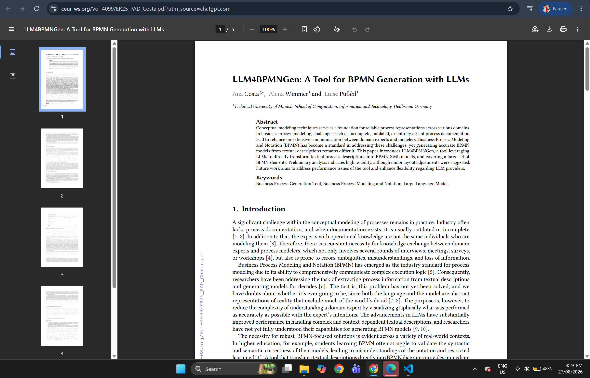
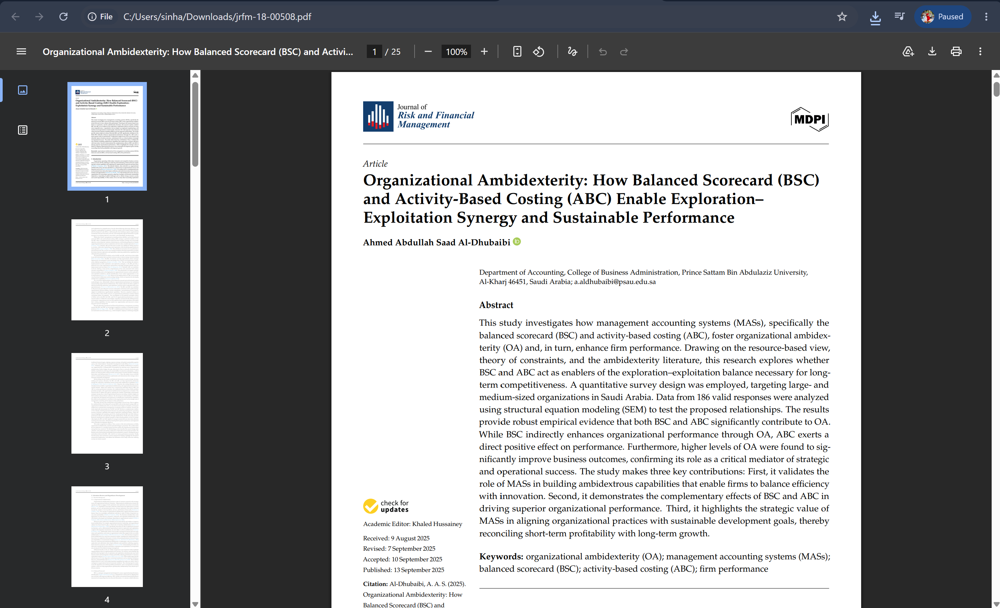
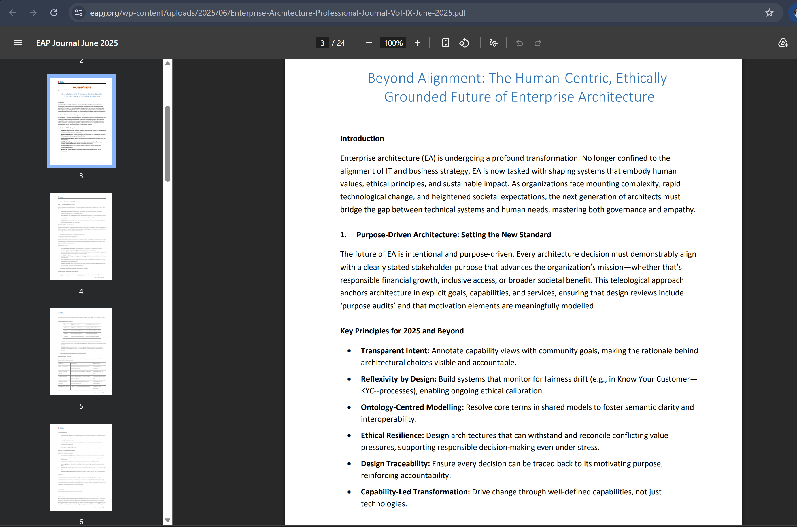
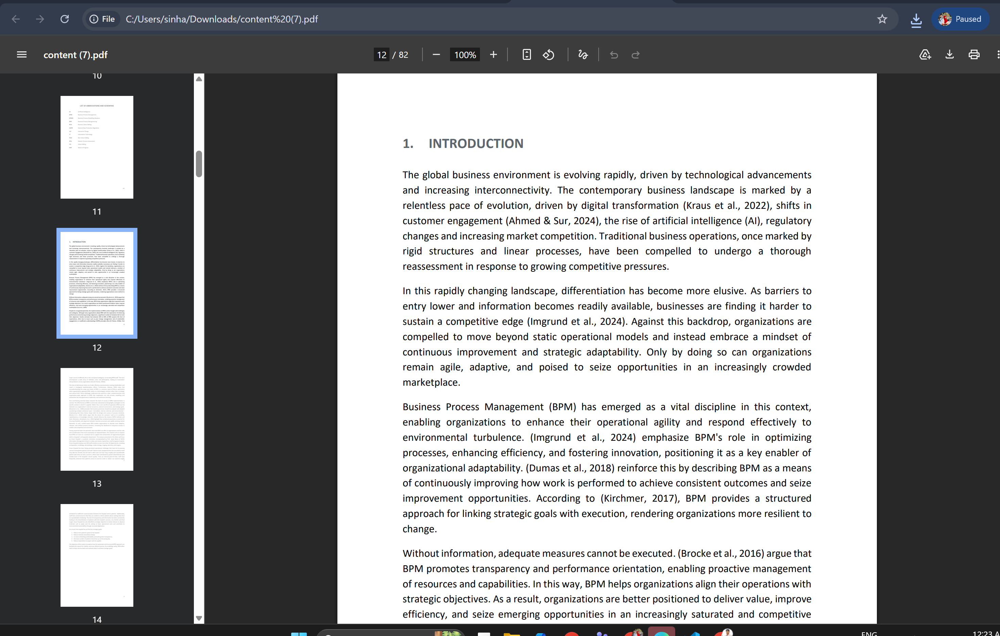

# COIT20252 Business Process Management

## e-Portfolio 2: Business Process Modelling

**Student name:** Mst Sinha Naznin  
**Student ID:** 12285155  
**Term:** 2  2026

---

## Artefact 1: AI-assisted BPMN model generation Using LLMs

**Week:** 4  
**Artefact type:** Peer-Reviewed Conference paper  
**Link:** https://ceur-ws.org/Vol-4099/ER25_PAD_Costa.pdf?utm_source=chatgpt.com

**Summary:** Costa, Wimmer and Pufahl provide LLM4BPMNGen, a technique which translates any oral or written explanation of the process into an XML file of BPMN. The modules of this tool include input processing, model generation and refinement, completeness checking and diagram visualization. Six evaluators gave high usability scores; however, only 67% found the models generated by the system to be syntactically and semantically correct and thus, a human intervention is still required (Costa, Wimmer & Pufahl 2025, pp. 333–336).

**Justification:** I chose this artefact because it provides an extension to the discussions on BPMN from Week 4 through an up-to-date example of a modelling tool. It made me realize that while AI can help fill the translation gap between domain experts and modelers through generation of a good draft, it cannot substitute for the modelling expertise itself. I would check gateways, sequence flows, and layouts before archiving and automating the output.

Reference: Costa, A, Wimmer, A & Pufahl, L 2025, 'LLM4BPMNGen: a tool for BPMN generation with LLMs', in Companion proceedings of the 44th International Conference on Conceptual Modeling, CEUR Workshop Proceedings, vol. 4099, pp. 333–337, viewed 27 August 2026, https://ceur-ws.org/Vol-4099/ER25_PAD_Costa.pdf.

## Artefact 2: Balanced Scorecard for Process Performance

**Week:** 6  
**Artefact type:** Peer-Reviewed Journal Article  
**Link:** https://doi.org/10.3390/jrfm18090508

**Summary:** In her paper, Al-Dhubaibi studies the effectiveness of Balanced Scorecard and ABC in facilitating ambidexterity and performance based on 186 answers. The method translates strategy into metrics considering financial, customer, internal-process and learning perspectives. The study finds that the Balanced Scorecard helps improve performance through alignment of efficiency and exploration, not just because of implementation (Al-Dhubaibi 2025, pp. 2, 18-19).

**Justification:** This article was chosen because it provides an empirical foundation to the Balanced Scorecard content of Week 6. The indirect implication of this study is that selection of the metric alone will not work if managers fail to make use of it to link up strategy, process, and learning. As such, I would include outcome metrics like costs and cycle times along with leading metrics like innovation and capability development (Al-Dhubaibi 2025, pp. 19, 21).

Reference: Al-Dhubaibi, AAS 2025, 'Organizational ambidexterity: how Balanced Scorecard (BSC) and activity-based costing (ABC) enable exploration–exploitation synergy and sustainable performance', Journal of Risk and Financial Management, vol. 18, no. 9, article 508, viewed 27 August 2026, https://doi.org/10.3390/jrfm18090508.

## Artefact 3: Enterprise Architecture Repository as a Knowledge Hub
**Week:** 5  
**Artefact type:** Professional Website Article  
**Link:** https://eapj.org/wp-content/uploads/2025/06/Enterprise-Architecture-Professional-Journal-Vol-IX-June-2025.pdf

**Summary:** Prim & de Oliveira analyse the enterprise architecture practice in a financial company from Brazil. The firm created its own value chain, business domains, products and services, technology, and data, and then linked them together in the architecture repository. For three years, the repository grew into the knowledge centre helping to make strategic transformation decisions, and the governance kept proper roadmaps and relationships for more than 500 projects (Prim & de Oliveira 2025, pp. 12-13, 18-19).

**Justification:** This is the article I selected because it applies to the Week 5 process repository and enterprise architecture approaches. It taught me that a repository does not have any value until the artefacts are interconnected, constantly updated and synchronized with the strategic goals. In this case, I would define the owner and the process of reviewing before implementing the process models into the repository.

Reference: Prim, AL & de Oliveira, TL 2025, 'Lessons from the implementation of an enterprise architecture: a finance industry case study', Enterprise Architecture Professional Journal, vol. IX, June, viewed 27 August 2026, https://eapj.org/wp-content/uploads/2025/06/Enterprise-Architecture-Professional-Journal-Vol-IX-June-2025.pdf.

## Artefact 4: Hospital Process Redesign Through Waste Reduction
**Week:** 6  
**Artefact type:** Master’s Thesis  
**Link:** https://run.unl.pt/handle/10362/190259

**Summary:** The hospital consultation process is illustrated by Santos, categorizes activities according to value and waste, and simulates improved alternatives via Bizagi. Of the 27 tasks studied, 45 per cent are value-added, with waiting appearing in one-third of modeled activities. The “to be” model used elimination, composition, automation, and digitization choices, cutting cycle time and wait time in the redesigned subprocesses (Santos 2025, pp. 29-30, 47-48).

**Justification:** This artifact applies the principles of design and types of wastes discussed in Week 6 to delay in hospitals. I realized that redesigning should start by gathering evidence rather than drawing an appealing future-state picture. The involvement of stakeholders, along with value analysis and simulation, identified the bottleneck and the impacts of change suggestions. I would adopt this process before the actual implementation, as the proven future-state design will justify the investment.

Reference: Santos, TGM 2025, Business process management for operational efficiency: a case study of process redesign in a hospital setting, master's thesis, NOVA Information Management School, Universidade Nova de Lisboa, viewed 27 August 2026, https://run.unl.pt/handle/10362/190259.

## AI Disclosure

I used ChatGPT by OpenAI to generate ideas, to perform research and to help me structure my paper. I have examined the sources and publication details of my chosen references to ensure that they are credible and relevant to the task. Finally, I will rework the paper in my own words before submitting it.

