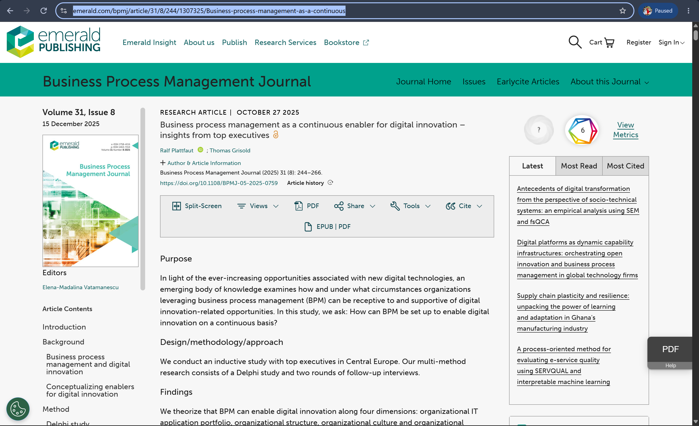

# COIT20252 Business Process Management

## e-Portfolio 3: Robotic Process Automation and Process Cybersecurity

**Student name:** Mst Sinha Naznin  
**Student ID:** 12285155  
**Term:** 2  2026

---

## Artefact 1: AI-Assisted Business Process Analysis

**Week:** 7  
**Artefact type:** Peer-Reviewed Journal Article  
**Link:** https://www.emerald.com/bpmj/article/31/8/244/1307325/Business-process-management-as-a-continuous

**Summary:** Fettke and Di Francescomarino research how artificial intelligence (AI) fits into the BPM lifecycle. They note that natural-language processing plus machine learning and knowledge representation and automated reasoning can help in process modelling, analysis, redesign and control. In relation to analysis, the authors highlight that such approaches as natural-language processing, machine learning, knowledge representation, and automated reasoning can improve the quality of process logs, enabling the identification of patterns, weaknesses, and insights (Fettke & Di Francescomarino 2025, pp. 69-75).

**Justification:** I chose this particular artefact as it built upon the discussion on emerging technologies from week 1, in particular, how they can be integrated into the processes. I think this particular artefact helped me understand that while AI can support analysts by providing suggestions, it is important to keep in mind how easily such suggestions can be mistaken and abused, as well as the need for human oversight in order to obtain reliable results.

Reference:Fettke, P & Di Francescomarino, C 2025, ‘Business process management and artificial intelligence: literature survey and future research’, KI – Künstliche Intelligenz, vol. 39, viewed 6 August 2026, https://doi.org/10.1007/s13218-025-00891-y.

----
