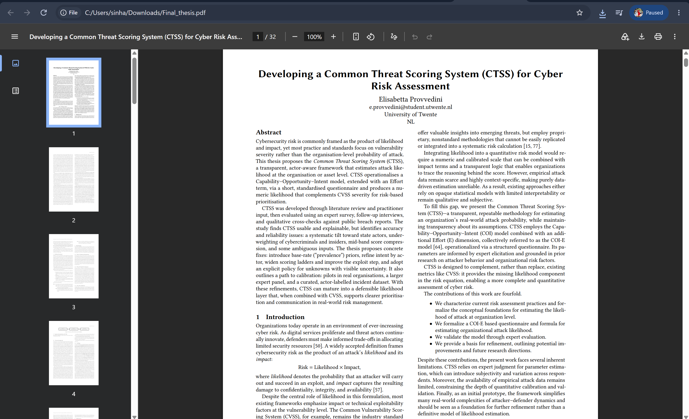
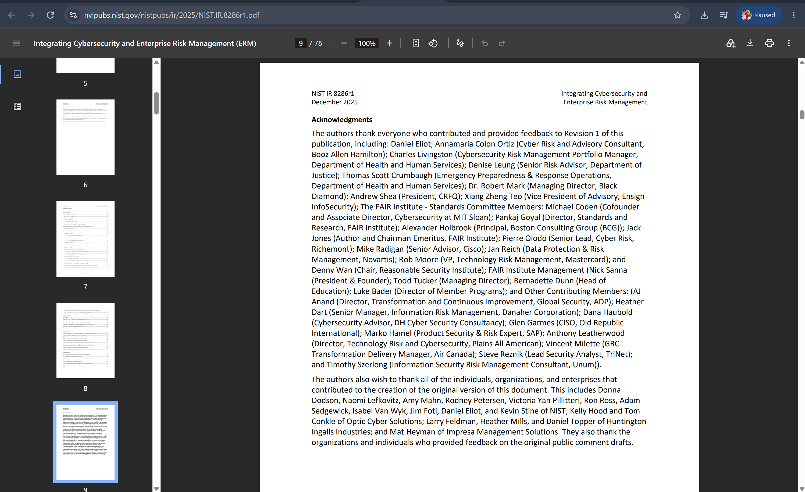

# COIT20252 Business Process Management

## e-Portfolio 3: Robotic Process Automation and Process Cybersecurity

**Student name:** Mst Sinha Naznin  
**Student ID:** 12285155  
**Term:** 2  2026

---

## Artefact 1: AI-Assisted Business Process Analysis

**Week:** 7  
**Artefact type:** Peer-Reviewed Journal Article  
**Link:** https://www.emerald.com/bpmj/article/31/8/244/1307325/Business-process-management-as-a-continuous

**Summary:** The research by Plattfaut and Grisold focuses on understanding the ways in which BPM could continuously facilitate innovation in the digital environment and not just as a series of separate projects aimed at redesigning processes. Through their Delphi technique and executive interviews, Plattfaut and Grisold found four enablers, such as flexible IT systems, dual structures, a spirit of experimentation, and the ability to implement digital opportunities (Plattfaut & Grisold 2025, pp. 244-247, 257).

**Justification:** I chose the article because it links Week 7 topics of digital transformation and technology as enabler. It made me understand that simply purchasing an RPA, AI or any other technology alone will not lead to transformation of the process. The organization needs to make sure that technology is linked to process ownership, capabilities of the employees and the culture. At work, I will ensure that the existing process is mapped and the capability gaps are identified before automating the process (Plattfaut & Grisold 2025, pp. 257–261).

Reference: Plattfaut, R & Grisold, T 2025, 'Business process management as a continuous enabler for digital innovation – insights from top executives', Business Process Management Journal, vol. 31, no. 8, pp. 244–266, viewed 22 September 2026, https://doi.org/10.1108/BPMJ-05-2025-0759.

----

## Artefact 2:  RPA Process Selection and Measurable Improvement

**Week:** 8  
**Artefact type:** Conference Paper  
**Link:** https://scholarspace.manoa.hawaii.edu/bitstreams/7ff84fa7-ceab-4497-b297-10fc57183e67/download

**Summary:** Frick reviews influences influencing RPA implementation in public administrations using a systematic literature review of 23 research papers. The research reveals 31 barriers, 28 facilitators, and 26 prerequisites, with 18 factors being interrelated via supportive and conflicting relations. It proves that adoption requires process standardization, quality of data, digital maturity, skills, regulation, and accountability (Frick 2025, pp. 2122, 2125–2129).

**Justification:** This article was chosen to back up Week 8's RPA benefits, constraints and vendor/process assessment themes. I found out that even an appropriate repetitive process may be unsuccessful due to insufficient organisational preparedness and governance. In Coles, I would assess criteria such as rules, transaction volume, data structure, exceptions, system integration, personnel capabilities and privacy prior to automating. An evidence-based screening approach would assist me in determining the appropriate RPA application options without involving too many decisions made on a discretionary basis (Frick 2025, pp. 2126–2129).

Reference: Frick, N 2025, 'Relationships between factors influencing robotic process automation adoption in public administrations: a systematic literature review', in Proceedings of the 58th Hawaii International Conference on System Sciences, pp. 2122–2131, viewed 24 September 2026, https://scholarspace.manoa.hawaii.edu/items/c73440b0-f57c-4b9c-a09f-eb50848adf81.

----

## Artefact 3:  Cyber Risk Assessment Using Threat Likelihood

**Week:** 9  
**Artefact type:** Master’s Thesis  
**Link:** https://essay.utwente.nl/essays/108970

**Summary:** Provvedini proposes Common Threat Scoring System, which is actor-aware and determines the probability of attack on the organization. The CTSS estimates capability, opportunity, intent and effort based on the answers in the questionnaire and adds to the CVSS measure of severity for prioritization. The method is considered understandable and valuable for decision making; however, there is a tendency towards state actors’ bias and score compression due to ambiguous data (Provvedini 2025, pp. 1–3, 12, 16–18).

**Justification:** This is the reason why I chose this Master’s thesis as it takes the risk assessment activity from Week 9 to another level that goes beyond the use of likelihood-impact matrix. This is where I realized that it is only through scoring that there is transparency when the assumptions, limitations and uncertainties are not hidden. The outcome of such numerical analysis must help the practitioner make a decision and not be the decision itself (Provvedini 2025, pp. 16-18).

Reference: Provvedini, E 2025, Developing a Common Threat Scoring System (CTSS) for cyber risk assessment, master's thesis, University of Twente, viewed 22 September 2026, https://essay.utwente.nl/essays/108970.

----

## Artefact 4:  Integrating Process Cybersecurity with Enterprise Risk

**Week:** 8  
**Artefact type:** Government Publication  
**Link:** https://csrc.nist.gov/pubs/ir/8286/r1/final

**Summary:** Quinn et al. clarify how cybersecurity risk management should integrate with enterprise risk management and not stay confined within technical silos. NIST suggests that the threats, probability, impact, response and ownership should be recorded in cybersecurity risk registers, which can be combined into enterprise risk profiles. This integration is intended to align risks with business goals and facilitate constant monitoring and communications (Quinn et al. 2025, pp. 1-3, 12, 34-36).

**Justification:** The reason why I chose this particular government document is that it adds value to the discussion of process-cybersecurity and the NIST Framework during Week 8. What it taught me is that securing a process goes beyond merely implementing controls but requires leaders to have continuous information in order to prioritize risks and resources. In an enrollment breach at a university, I would document the impacted assets, vulnerabilities, likelihood, impact, owners and remediation, and then manage the register.

Reference: Quinn, SD, Chua, J, Ivy, N, Gardner, RK, Kent, K, Smith, MC & Witte, GA 2025, Integrating cybersecurity and enterprise risk management (ERM), NIST Interagency Report 8286 Revision 1, National Institute of Standards and Technology, viewed 22 September 2026, https://doi.org/10.6028/NIST.IR.8286r1.

## AI Disclosure

I used ChatGPT by OpenAI to generate ideas, to perform research and to help me structure my paper. I have examined the sources and publication details of my chosen references to ensure that they are credible and relevant to the task. Finally, I will rework the paper in my own words before submitting it.

