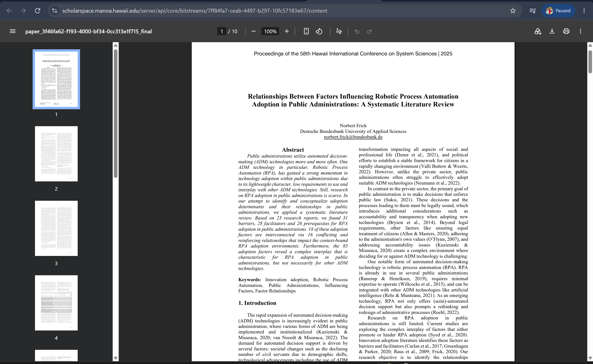

# COIT20252 Business Process Management

## e-Portfolio 3: Robotic Process Automation and Process Cybersecurity

**Student name:** Mst Sinha Naznin  
**Student ID:** 12285155  
**Term:** 2  2026

---

## Artefact 1: AI-Assisted Business Process Analysis

**Week:** 7  
**Artefact type:** Peer-Reviewed Journal Article  
**Link:** https://www.emerald.com/bpmj/article/31/8/244/1307325/Business-process-management-as-a-continuous

**Summary:** The research by Plattfaut and Grisold focuses on understanding the ways in which BPM could continuously facilitate innovation in the digital environment and not just as a series of separate projects aimed at redesigning processes. Through their Delphi technique and executive interviews, Plattfaut and Grisold found four enablers, such as flexible IT systems, dual structures, a spirit of experimentation, and the ability to implement digital opportunities (Plattfaut & Grisold 2025, pp. 244-247, 257).

**Justification:** I chose the article because it links Week 7 topics of digital transformation and technology as enabler. It made me understand that simply purchasing an RPA, AI or any other technology alone will not lead to transformation of the process. The organization needs to make sure that technology is linked to process ownership, capabilities of the employees and the culture. At work, I will ensure that the existing process is mapped and the capability gaps are identified before automating the process (Plattfaut & Grisold 2025, pp. 257–261).

Reference: Plattfaut, R & Grisold, T 2025, 'Business process management as a continuous enabler for digital innovation – insights from top executives', Business Process Management Journal, vol. 31, no. 8, pp. 244–266, viewed 22 September 2026, https://doi.org/10.1108/BPMJ-05-2025-0759.

----

## Artefact 2:  RPA Process Selection and Measurable Improvement

**Week:** 8  
**Artefact type:** Conference Paper  
**Link:** https://scholarspace.manoa.hawaii.edu/bitstreams/7ff84fa7-ceab-4497-b297-10fc57183e67/download

**Summary:** The research by Plattfaut and Grisold focuses on understanding the ways in which BPM could continuously facilitate innovation in the digital environment and not just as a series of separate projects aimed at redesigning processes. Through their Delphi technique and executive interviews, Plattfaut and Grisold found four enablers, such as flexible IT systems, dual structures, a spirit of experimentation, and the ability to implement digital opportunities (Plattfaut & Grisold 2025, pp. 244-247, 257).

**Justification:** I chose the article because it links Week 7 topics of digital transformation and technology as enabler. It made me understand that simply purchasing an RPA, AI or any other technology alone will not lead to transformation of the process. The organization needs to make sure that technology is linked to process ownership, capabilities of the employees and the culture. At work, I will ensure that the existing process is mapped and the capability gaps are identified before automating the process (Plattfaut & Grisold 2025, pp. 257–261).

Reference: Plattfaut, R & Grisold, T 2025, 'Business process management as a continuous enabler for digital innovation – insights from top executives', Business Process Management Journal, vol. 31, no. 8, pp. 244–266, viewed 22 September 2026, https://doi.org/10.1108/BPMJ-05-2025-0759.
